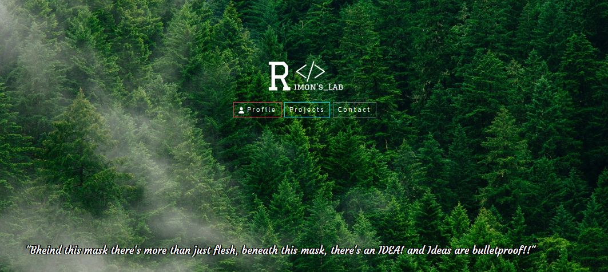

Hello, I desing and develop web based app and site as a full stack developer from Dhaka, Bangladesh. I have completed my B.Sc. in Computer Science and Telecommunication Engineering, where my major is CSE from Noakhali Science and Technology University (NSTU). 
  
Through my github, you will witness my creativity, problem-solving abilities, and my commitment to delivering high-quality solutions. Join me on this thrilling journey as I explore new opportunities in the world of web development with Laravel, PHP, React, and  JavaScript area. Also have a strong problem solving and competetive programming skills in  C and  C++.  

