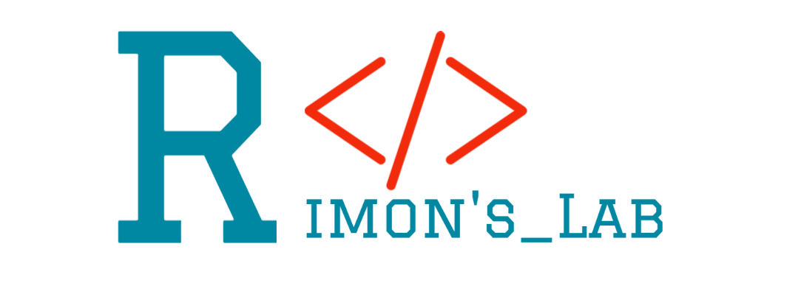

 
<!-- ========================= -->
<!--      GitHub README        -->
<!-- ========================= -->

<h1 align="center">Hi 👋, I'm Rimon Rony</h1>

<h3 align="center">
Software Engineer | Full Stack Developer | Problem Solver
</h3>

Passionate about building scalable software, modern web applications, and impactful digital solutions.

---

<h2>👨‍💻 About Me</h2>

I am a Computer Science graduate from Bangladesh with a strong passion for software engineering, problem solving, and modern technologies.

I specialize in building modern full-stack applications using React, Next.js, JavaScript, TypeScript, Node.js, Laravel, PHP, and MongoDB.

I enjoy creating clean, scalable, and user-focused applications with professional UI/UX and maintainable architecture.

Beyond development, I have strong analytical and competitive programming skills in C and C++, with deep interests in data structures, algorithms, system design, and modern software engineering practices.

Currently exploring Artificial Intelligence, Machine Learning, scalable system architecture, and advanced engineering concepts.

---

<h2>🚀 Tech Stack</h2>

---

<h2>📌 Current Focus</h2>

<ul>
  <li>Building production-grade full stack applications</li>
  <li>Strengthening DSA & problem solving skills</li>
  <li>Exploring AI-powered applications</li>
  <li>Learning scalable system architecture</li>
  <li>Creating clean and modern UI/UX</li>
</ul>

---

<h2>🌍 Interests</h2>

<ul>
  <li>Full Stack Development</li>
  <li>Software Engineering</li>
  <li>Artificial Intelligence</li>
  <li>Competitive Programming</li>
  <li>System Design</li>
  <li>Modern Web Technologies</li>
</ul>

---

---

<h2>🔥 GitHub Streak</h2>

---

<h2>📈 Contribution Graph</h2>

---

---

<h2>📫 Connect With Me</h2>

<a href="https://github.com/Rimon-Mahamud-Rony" target="_blank">
GitHub
</a>

 

<a href="https://www.linkedin.com/" target="_blank">
LinkedIn
</a>

---

<h2>🌐 Portfolio</h2>

<a href="https://github.com/Rimon-Mahamud-Rony" target="_blank">
Visit My GitHub Profile
</a>

---

<h3 align="center">

✨ "Code is not just logic — it is engineering creativity." ✨

</h3>

